# converge-example-baby-app

**A Flutter app, generated from one `idea.md`, in 4 hours — by [Converge](https://github.com/openplaybooks-dev/converge).**

[](https://github.com/openplaybooks-dev/converge-example-baby-app/actions/workflows/smoke.yml)
[](./LICENSE)

This repo is a public showcase of **[Converge](https://github.com/openplaybooks-dev/converge)** — the autonomous playbook framework. We wrote one input file (`idea.md`) describing a pregnancy companion app called **Bloom**, pointed Converge at it, and let the 8-task playbook DAG run. Four hours later, the framework had produced a buildable Flutter app with 13 screens, ~8,000 lines of Dart, a Material 3 theme, a Riverpod + GoRouter foundation, and a complete execution journal that's committed at the path `.converge/journal/default/` so you can audit every step.

Everything in `lib/`, `.stitch/`, `docs/`, and `.converge/journal/` below was produced by `converge run` against MiniMax-M2.7 on 2026-05-18. No hand-edits to generated code.

## The numbers from this run

| | |
| ---: | :--- |
| Wall-time | **4.22 h** |
| LLM cost | **$0.6133 USD** (138 sessions, MiniMax-M2.7) |
| Cache hit rate | **88.0 %** (65M of 73.6M total prompt tokens served from cache) |
| Total DAG tasks | **198** (1 root + 8 phases + per-screen child fan-out) |
| Tool calls executed | **2,514** (Read · Bash · Glob · Edit · Write · Grep · Skill · TaskUpdate) |
| Events recorded | **41,782** in `.converge/journal/default/events.jsonl` |
| Generated Dart code | **7,914 LoC** across **20 files** |
| Generated screens | **13** |
| Stitch design artifacts | **60 files** across 13 screen design dirs |
| Reusable skills | **24** (under `.converge/skills/`) |

Full breakdown in **[docs/METRICS.md](./docs/METRICS.md)** · chronological timeline in **[docs/RUN_LOG.md](./docs/RUN_LOG.md)**.

## The app — all 13 generated screens

<table>
<tr>
<td width="50%" align="center">
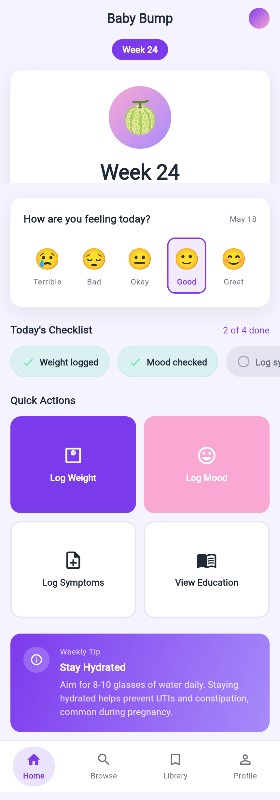<br>
<sub><b>1. Home — <code>/</code></b><br>Week tracker, mood selector, daily checklist, quick actions, weekly health tip.</sub>
</td>
<td width="50%" align="center">
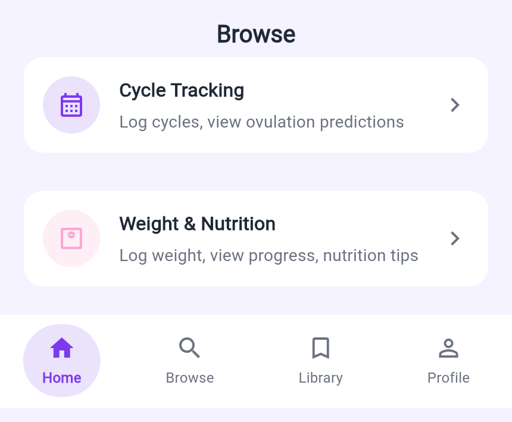<br>
<sub><b>2. Browse — <code>/browse</code></b><br>Feature index — entry point to Cycle Tracking and Weight & Nutrition.</sub>
</td>
</tr>
<tr>
<td width="50%" align="center">
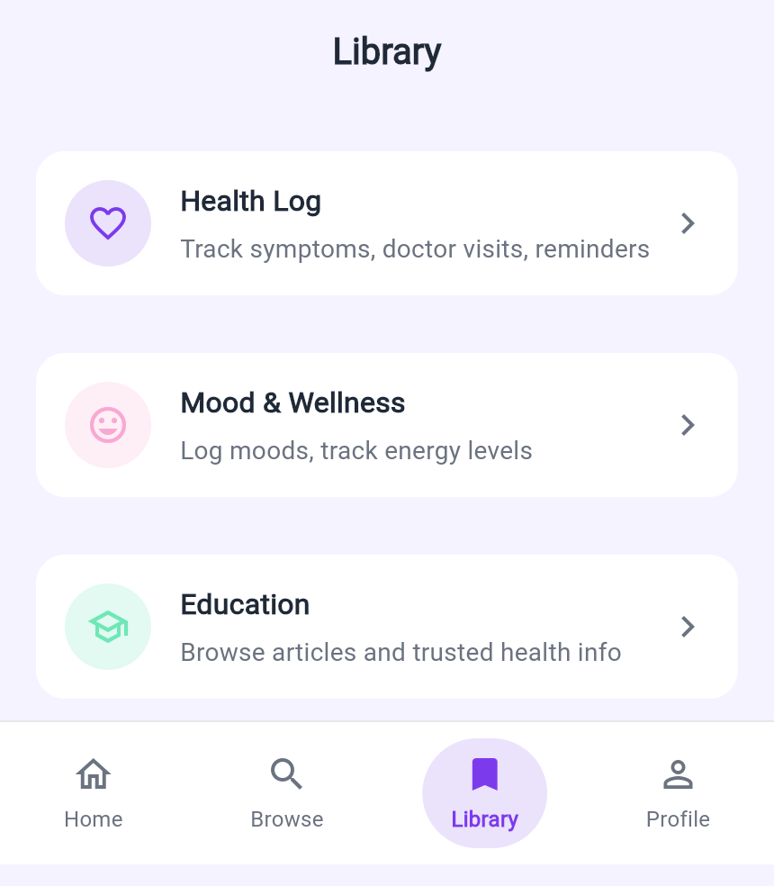<br>
<sub><b>3. Library — <code>/library</code></b><br>Saved articles and bookmarks.</sub>
</td>
<td width="50%" align="center">
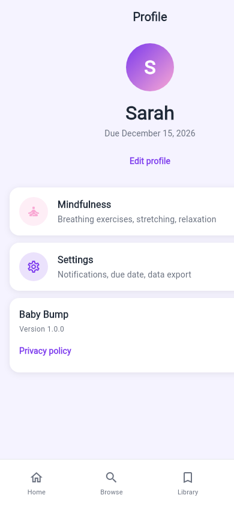<br>
<sub><b>4. Profile — <code>/profile</code></b><br>User profile, pregnancy details, navigation.</sub>
</td>
</tr>
<tr>
<td width="50%" align="center">
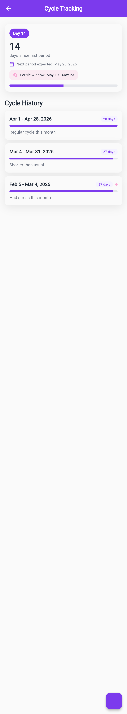<br>
<sub><b>5. Cycle Tracking — <code>/cycle-tracking</code></b><br>Period log with fertile-window prediction and cycle history.</sub>
</td>
<td width="50%" align="center">
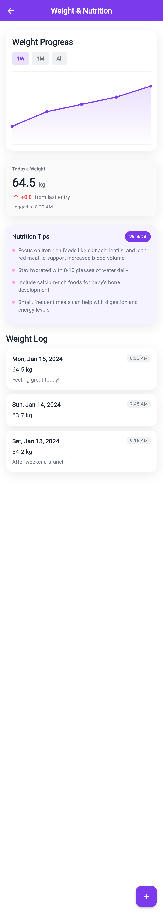<br>
<sub><b>6. Weight & Nutrition — <code>/weight-nutrition</code></b><br>Weight progress chart with time-range tabs and nutrition tips.</sub>
</td>
</tr>
<tr>
<td width="50%" align="center">
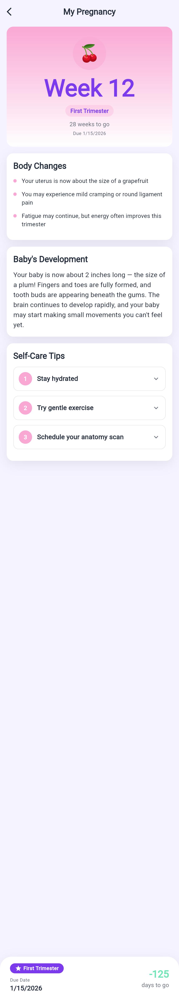<br>
<sub><b>7. Pregnancy Progress — <code>/pregnancy-progress</code></b><br>Week-by-week detail: baby size, body changes, baby's development.</sub>
</td>
<td width="50%" align="center">
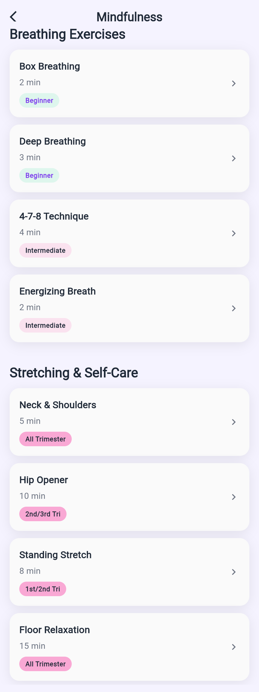<br>
<sub><b>8. Mindfulness — <code>/mindfulness</code></b><br>Breathing exercises and guided stretches.</sub>
</td>
</tr>
<tr>
<td width="50%" align="center">
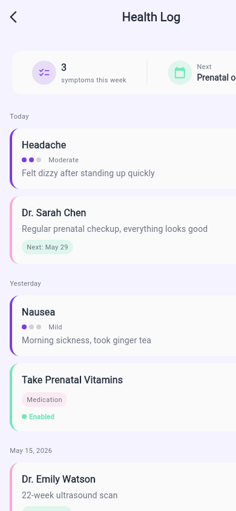<br>
<sub><b>9. Health Log — <code>/health-log</code></b><br>Doctor visits, reminders, symptom tracking.</sub>
</td>
<td width="50%" align="center">
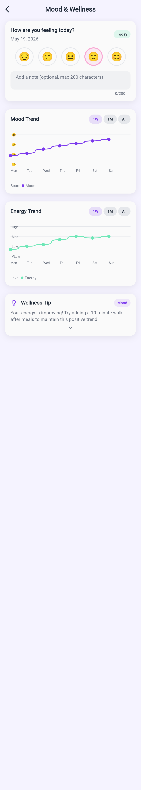<br>
<sub><b>10. Mood & Wellness — <code>/mood-wellness</code></b><br>Today's mood, energy levels, wellness trend chart.</sub>
</td>
</tr>
<tr>
<td width="50%" align="center">
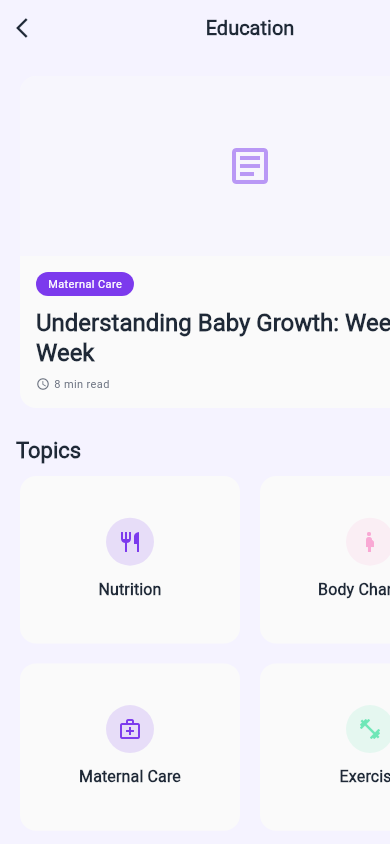<br>
<sub><b>11. Education — <code>/education</code></b><br>Curated articles by trimester.</sub>
</td>
<td width="50%" align="center">
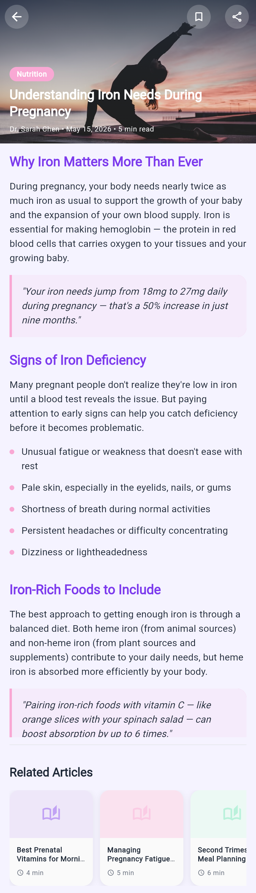<br>
<sub><b>12. Article Reader — <code>/article-reader/:id</code></b><br>Long-form reading view with quote callouts and related articles.</sub>
</td>
</tr>
<tr>
<td width="50%" align="center">
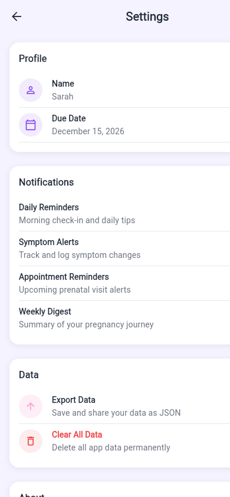<br>
<sub><b>13. Settings — <code>/settings</code></b><br>Account, preferences, about.</sub>
</td>
<td width="50%"></td>
</tr>
</table>

## What `converge run` actually did

The committed journal records an honest run: 64 of 198 tasks completed (the first two phases plus per-screen spec/design/convert/analyze for all 13 screens) before the playbook hit a blocking failure at `03-build-screens` on retry 2. That's why `assets/illustrations/` is empty and the test suite wasn't generated — Converge stops the cascade rather than producing nonsense once a gate fails. To exercise the **full** DAG end-to-end without paying for image generation, the CI smoke workflow runs `IMAGE_BACKEND=stub ./scripts/clean.sh && ./scripts/run.sh` on every push — see the green badge above.

| Phase | Status | Produced |
| :--- | :--- | :--- |
| `01-prepare-requirements` | ✓ | `.stitch/UX.md`, `.stitch/SITE.md`, `.stitch/screens.json`, refined `PRD.md` |
| `02-design-system` | ✓ | `lib/theme/app_theme.dart`, design tokens |
| `03-build-screens` | ✗ blocked the rest | partial `lib/screens/*` (13 screen scaffolds) |
| `05-add-behavior` → `09-generate-tests` | ⊘ blocked | not executed |

## The output folders

After `converge run` exits, here's what's on disk:

```
.
├── idea.md, PRD.md, data-models.md, navigations.json  ← INPUT (hand-authored)
├── pubspec.yaml, assets/assets.json                   ← INPUT (Flutter config + asset manifest)
│
├── lib/                                ← OUTPUT — 20 Dart files, 7,914 LoC
│   ├── main.dart                       (app bootstrap)
│   ├── theme/app_theme.dart            (Material 3 tokens from task 02)
│   ├── router/app_router.dart          (GoRouter wiring from task 06)
│   └── screens/<13 dirs>/              (per-screen widgets + _widgets/ subtrees)
│
├── .stitch/                            ← OUTPUT — UX + design layer (60 files)
│   ├── UX.md, SITE.md, screens.json
│   ├── designs/<13 dirs>/              (per-screen HTML mockups)
│   └── system/                         (design system reference)
│
├── .converge/journal/default/          ← OUTPUT — the audit trail
│   ├── events.jsonl                    (41,782 events)
│   ├── execution.log
│   ├── metadata.json, runstate.json, manifest.json, trends.jsonl
│   └── tasks/<73 task dirs>/           (per-task attempts, logs, checkpoints)
│
└── docs/                               ← derived from the journal
    ├── METRICS.md                      (numbers above, parsed from journal)
    ├── RUN_LOG.md                      (human-readable timeline)
    └── screenshots/                    (13 PNGs, this README's scroll-through)
```

## Re-run this

```bash
cp .env.example .env && $EDITOR .env     # fill in MINIMAX_API_KEY
./scripts/clean.sh                        # wipe generated artifacts; keep inputs
./scripts/run.sh                          # ~30–60 min end-to-end (~$1 in MiniMax tokens)

# free smoke test — same DAG, no image-API spend, ~10 min:
IMAGE_BACKEND=stub ./scripts/clean.sh && ./scripts/run.sh
```

After a run, regenerate the proof artifacts in `docs/`:

```bash
node scripts/extract-metrics.mjs          # → docs/METRICS.md + docs/RUN_LOG.md
./scripts/capture-screenshots.sh           # → docs/screenshots/*.png  (needs Flutter + Chrome)
```

## Inputs you can edit

Want a different app? Edit these five files, re-run, and Converge re-derives everything below them.

| Input | Drives | Output it generates |
| :--- | :--- | :--- |
| `idea.md` | task 01 | refined `PRD.md`, `.stitch/UX.md`, `.stitch/SITE.md`, `.stitch/screens.json` |
| `data-models.md` | task 05 | `lib/models/*.dart` (Freezed), `lib/data/mock_data.dart` |
| `navigations.json` | task 06 | `lib/router/app_router.dart` + per-screen `onPressed` wiring |
| `pubspec.yaml` | always | dependency tree + asset declarations |
| `assets/assets.json` | task 08 | manifest reference (categories + counts) |

## About Converge

Converge is autonomous playbook orchestration: a runtime that executes a DAG of LLM-driven tasks, gates each transition on real shell-level checks (here: `flutter pub get`, `dart analyze`, `flutter build`, `flutter test`), and retries until every goal converges or an attempt cap is hit. The playbook — not the chat transcript — is the durable artifact.

- **Framework:** <https://github.com/openplaybooks-dev/converge>
- **Examples gallery:** [`converge/docs/examples`](https://github.com/openplaybooks-dev/converge/tree/main/docs/examples)
- **Peer showcases under the same org:**
  - [`converge-stack`](https://github.com/openplaybooks-dev/converge-stack) — Garry Tan's Claude Code setup, fully playbookified.
  - [`converge-agent`](https://github.com/openplaybooks-dev/converge-agent) — Production-grade engineering skills for AI coding agents.
  - [`converge-godogen`](https://github.com/openplaybooks-dev/converge-godogen) — Autonomous game development for Godot and Bevy.

## License

[MIT](./LICENSE) © 2026 Minh Luc · Built with [Converge](https://github.com/openplaybooks-dev/converge).
